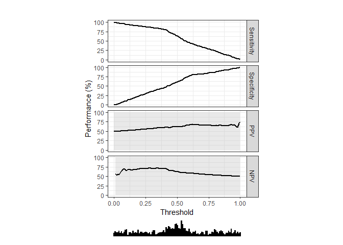
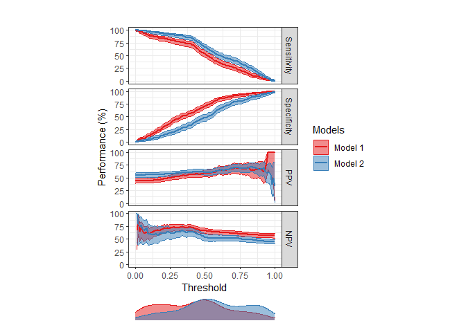
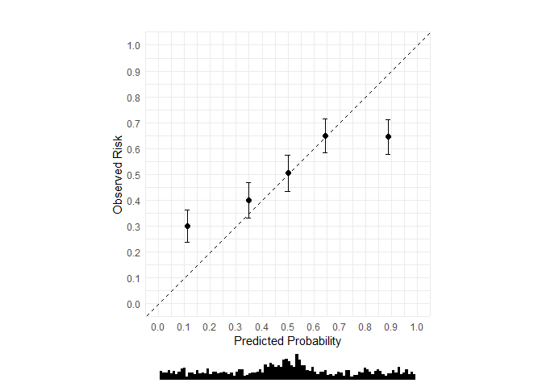
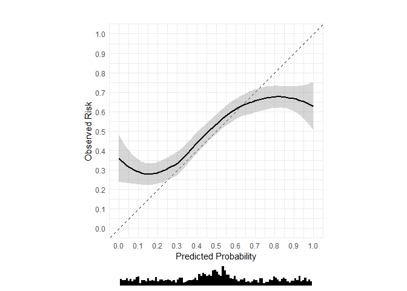
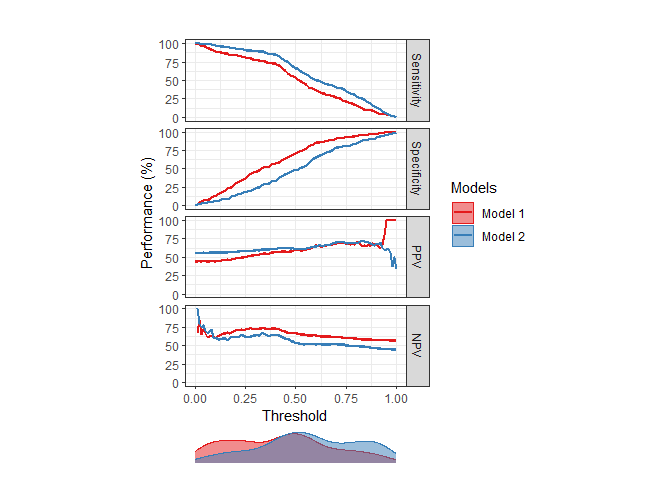
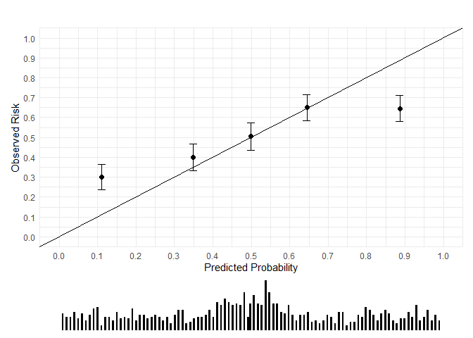
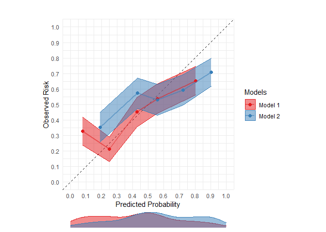
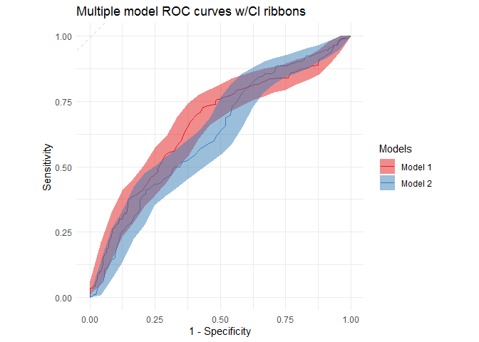

<!-- README.md is generated from README.Rmd. Please edit that file -->

# runway

<!-- badges: start -->

[](https://www.tidyverse.org/lifecycle/#maturing)
<!-- badges: end -->

The goal of runway is to generate statistics and plots to calculate
discrimination, calibration, and decision curves for prediction models.

## Why is it called runway?

Because you can use it to visually compare models.

Sometimes your models look quite different.


Other times your models look the same…


## Installation

You can install `runway` from GitHub with:

``` r
remotes::install_github('ML4LHS/runway')
```

## Load the package

First, load the package.

``` r
library(runway)
```

## Sample datasets

Runway comes with two sample datasets.

``` r
data(single_model_dataset)
head(single_model_dataset)
#>   outcomes predictions
#> 1        0        0.36
#> 2        1        0.31
#> 3        0        0.39
#> 4        0        0.09
#> 5        0        0.44
#> 6        1        0.22

data(multi_model_dataset)
head(multi_model_dataset)
#>   outcomes predictions model_name
#> 1        0        0.26    Model 2
#> 2        1        0.28    Model 1
#> 3        0        0.56    Model 2
#> 4        0        0.27    Model 1
#> 5        0        0.31    Model 1
#> 6        0        0.42    Model 2
```

## Evaluating a single model

### Threshold-performance plot (single model)

``` r
threshperf_plot(single_model_dataset,
                outcome = 'outcomes',
                positive = '1',
                prediction = 'predictions')
```



### Calibration plot with 10 bins (single model)

Note: 10 bins is the default.

``` r
cal_plot(single_model_dataset,
         outcome = 'outcomes',
         positive = '1',
         prediction = 'predictions')
```



### Calibration plot with 5 bins (single model)

``` r
cal_plot(single_model_dataset,
         outcome = 'outcomes',
         positive = '1',
         prediction = 'predictions',
         n_bins = 5)
```



### Calibration plot with loess curve (single model)

``` r
cal_plot(single_model_dataset,
         outcome = 'outcomes',
         positive = '1',
         prediction = 'predictions',
         n_bins = 0,
         show_loess = TRUE)
```



## Comparing multiple models

### Threshold-performance plot (multiple models)

``` r
threshperf_plot_multi(multi_model_dataset,
                      outcome = 'outcomes',
                      positive = '1',
                      prediction = 'predictions',
                      model = 'model_name')
```



### Calibration plot with 10 bins (multiple models)

Note: 10 bins is the default.

``` r
cal_plot_multi(multi_model_dataset,
         outcome = 'outcomes',
         positive = '1',
         prediction = 'predictions',
         model = 'model_name')
```



## Calibration plot with 5 bins (multiple models)

``` r
cal_plot_multi(multi_model_dataset,
         outcome = 'outcomes',
         positive = '1',
         prediction = 'predictions',
         model = 'model_name',
         n_bins = 5)
```


## Calibration plot with loess curve (multiple models)

Unlike single calibration plots, the choice of binned calibration and
loess calibration are mutually exclusive. To show less curves, you must
set `show_loess` to `TRUE` *and* `n_bins` to `0`.

``` r
cal_plot_multi(multi_model_dataset,
         outcome = 'outcomes',
         positive = '1',
         prediction = 'predictions',
         model = 'model_name',
         n_bins = 0,
         show_loess = TRUE)
```



## ROC curve w/CI

``` r
roc_plot(single_model_dataset, 
         outcome = 'outcomes', 
         positive = '1',
         prediction = 'predictions',
         ci = TRUE, 
         plot_title = 'Single ROC curve w/CI ribbon')
```


## Multiple ROC curves w/CI ribbons

``` r
roc_plot_multi(multi_model_dataset, 
         outcome = 'outcomes', 
         positive = '1',
         prediction = 'predictions', 
         model = 'model_name',
         ci = TRUE,
         plot_title = 'Multiple model ROC curves w/CI ribbons')
```


